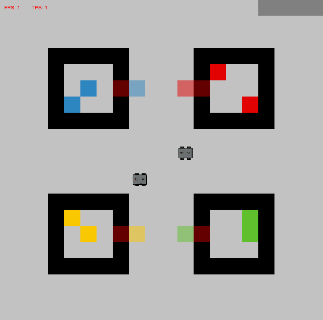

.. _Part 1: Setting up the skeleton

Part 1: Setting up the skeleton
===============================

In this series of tutorials, we will create the scenario of two agents co-operating to find, grab and deliver a certain sequence
of blocks. The two agents are autonomous, thus no human agents are involved in these tutorials. We will cover the implementation
of the block-gathering agent brain, and handle the communication between the two agents. Basic actions like building a
world and adding objects and agents to the world are assumed to be prior knowledge for this creating this scenario.

In this scenario, there are 4 rooms, each containing a certain color of blocks. Each room contains one door. The agents
cannot see what is inside a room before the door is opened. Together, the agents have to deliver a sequence of blocks
to a designated delivery area. The sequence is specified by the user. Once all blocks in the sequence have successfully
been delivered, the simulation is over.

The image below shows what the scene created during the tutorial looks like. Having trouble building this world? Check
the basic tutorials :ref:`Creating your MATRXS world` and :ref:`Adding objects`. Important for this particular solution
to solving the block sequence delivery is to name the rooms in the scenario according to the color of blocks the room
contains. In other words: make sure the word 'red' is in your room name when the room contains red blocks. The same goes
for the doors and blocks.

Brain initialization
--------------------
After having created the objects in the scenario, it is time to add the block-gathering agents. We will do so by creating
a new .py file in the MATRXS folder 'agents'. The skeleton of this agent brain contains the class initialization, the
method for filtering observations, and the method for deciding on an action. See 'AgentBrain' in Section :ref:`Brains` for
an overview of methods used in an agent's brain.

While initializing the brain, we create a state tracker to build the agent's memory, a navigator to cleverly move the
agent over the area, and we make sure that the agent knows what to do; what action to perform next for the given color.
We can divide the separate actions an agent has to perform in this task as follows:

- The agent has to find the room that contains the required block. In this scenario, the block color is indicated in the object names. For example, 'red_room' contains red blocks.
- Once the appropriate room has been found, the corresponding door has to be opened.
- The open door causes new information to appear in the agent's memory, namely the blocks and their location within the room. The agent now has to search the room for the location of one of the blocks.
- Once the agent is in the correct position, it can grab a block.
- While carrying the block, the agent moves to the drop-off area.
- The block is dropped once the agent has reached the drop-off area.
- If the entire sequence of blocks has been delivered, the agent does nothing.

In the snippet below, an example initialization is given.

.. code-block:: python

        def initialize(self):
        self.state_tracker = StateTracker(agent_id=self.agent_id)

        self.navigator = Navigator(agent_id=self.agent_id, action_set=self.action_set,
                                   algorithm=Navigator.A_STAR_ALGORITHM)

        self.goal_cycle = ["find_room", "open_door", "search_room", "grab_block", "to_dropoff" ,"drop_block", "done"]

        self.block_orders = ['yellow', 'green', 'blue', 'green', 'red']
Filtering observations
----------------------

.. code-block:: python

    def filter_observations(self, state):
        """
        Filtering the agent's observations.
        :param state:
        :return:
        """
        new_state = state.copy()
        closed_room_colors = []

        for k, obj in state.items():
            if 'door@' in k and obj.get('is_open') is False:
                color = k.split('_', 1)[0]
                closed_room_colors.append(color)
        for k, obj in state.items():
            for color in closed_room_colors:
                if (color in k) and ('doormat' not in k) and ('block' in k):
                    new_state.pop(k)

        self.state_tracker.update(new_state)
        return new_state
Action execution
----------------

.. code-block:: python

     def decide_on_action(self, state):
            """
            Decision of which action to perform.
            :param state:
            :return:
            """
            global cycle
            self.current_goal = self.goal_cycle[0]

            if len(self.block_orders) > 0:
                current_order = self.block_orders[0]
            else:
                return StandStill.__name__, {}

            this_agent = self.agent_id
            for k, obj in state.items():
                if 'Bot' in k and this_agent not in k:
                    other_agent = k

            objects = list(state.keys())
            doors = [obj for obj in objects
                     if 'class_inheritance' in state[obj] and state[obj]['class_inheritance'][0] == "Door"]
            door_locations = []
            door_ids = []
            for door in doors:
                door_ids.append(door)
                door_location = state[door]['location']
                door_locations.append(door_location)

            doormats = {}
            doormat_locations = []
            for obj in objects:
                if 'doormat' in obj:
                    doormats[obj] = {'doormat_id': obj, 'location': state[obj]['location']}
                    doormat_locations.append(state[obj]['location'])

            blocks = {}
            block_locations = []
            block_ids = []
            for obj in objects:
                if 'block' in obj:
                    blocks[obj] = {'block_id': obj, 'location': state[obj]['location']}
                    block_locations.append(state[obj]['location'])
                    block_ids.append(obj)

            return_area_ids = []
            return_area_locations = []
            for obj in objects:
                if 'drop' in obj:
                    return_area_ids.append(obj)
                    return_area_locations.append(state[obj]['location'])

            blocks_delivered = []
            for block in blocks:
                if blocks[block]['location'] in return_area_locations:
                    blocks_delivered.append(block)

            self.check_for_update(current_order)

            # Navigating to a room
            if self.current_goal == "find_room":
                # Setting location that is in front of a door
                self.navigator.reset_full()
                for doormat in doormats:
                    doormat_id = doormats[doormat]['doormat_id']
                    if current_order in doormat_id:
                        doormat_waypoint = doormats[doormat]['location']
                        self.navigator.add_waypoint(doormat_waypoint)
                        move_action = self.navigator.get_move_action(self.state_tracker)

                # Hacky way of going to the door that has not been opened yet.
                        current_waypoint = doormat_waypoint
                        if self.agent_properties['location'] == current_waypoint:
                            self.send_message(message_content={"id": doormat_id},
                                              to_id=other_agent)
                            self.goal_cycle.pop(0)

                return move_action, {}

            if self.current_goal == "open_door":
                for door in door_ids:
                    if current_order in door:
                        door_id = door
                if state[door_id]['is_open'] == True:
                    self.goal_cycle.pop(0)
                return OpenDoorAction.__name__, {'door_range': 1, 'object_id': door_id}

            if self.current_goal == "search_room":
                for block in blocks:
                    if current_order in blocks[block]['block_id'] and blocks[block]['location'] not in return_area_locations:
                        block_location = blocks[block]['location']
                if self.agent_properties['location'] == block_location:
                    self.goal_cycle.pop(0)
                    return StandStill.__name__, {}
                else:
                    self.navigator.reset_full()
                    self.waypoints = block_location
                    self.navigator.add_waypoint(self.waypoints)
                    move_action = self.navigator.get_move_action(self.state_tracker)
                    return move_action, {}

            if self.current_goal == "grab_block":

                for block in blocks:
                    if current_order in blocks[block]['block_id'] and blocks[block]['location'] not in return_area_locations:
                        block_id = blocks[block]['block_id']
                self.goal_cycle.pop(0)
                return GrabObject.__name__, {'grab_range': 1, 'object_id' : block_id, 'max_objects': 1}

            if self.current_goal == "to_dropoff":
                self.navigator.reset_full()
                self.waypoints = return_area_locations[cycle]
                self.navigator.add_waypoint(self.waypoints)
                move_action = self.navigator.get_move_action(self.state_tracker)
                current_waypoint = self.waypoints
                if self.agent_properties['location'] == current_waypoint:
                    self.goal_cycle.pop(0)
                    return StandStill.__name__, {}
                return move_action, {}

            if self.current_goal == "drop_block":
                self.goal_cycle.pop(0)
                self.goal_cycle = ["find_room", "open_door", "search_room", "grab_block", "to_dropoff", "drop_block",
                                       "done"]
                cycle += 1
                if cycle == len(door_ids):
                    cycle = 0

                if len(self.block_orders) > 0:
                    self.block_orders.pop(0)
                else:
                    pass
                return DropObject.__name__, {}

            return StandStill.__name__, {}
Under construction...